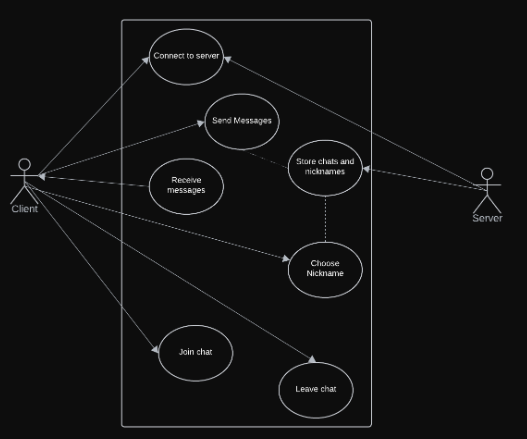
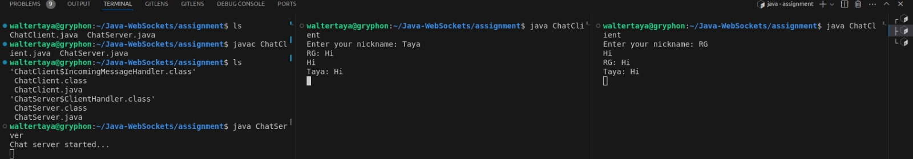

# Java Web Socket Programming Assignment

## Group Members:
- Walter Onyango - C026-01-0978/2022
- Samwel Njuguna - C026-01-0940/2022
- Clint Simiyu - C026-01-0972/2022
- Gibson Gichuru
- Brian Chege
- Baruk Ali

## Tasks
1. Write Software Engineering Requirements:
   - Identify functional and non-functional requirements.
   - Create necessary diagrams (e.g., use case diagrams, sequence diagrams).

2. Describe Algorithm Design:
   - Detail the interactions between clients and the server.
   - Provide pseudocode or flowcharts if necessary.

3. Develop TCP-based Java Implementation:
   - Implement the client and server code.
   - Ensure the code is robust, well-structured, and properly commented.
   - Handle exceptions and edge cases.

4. Test the Implementation:
   - Perform thorough testing to identify and document bugs or unexpected behaviours.

5. Discuss Alternative Implementation Using UDP:
   - Compare TCP and UDP implementations.
   - Discuss the advantages and disadvantages of each approach.

6. Prepare Deliverables:
   - Technical report (4-5 pages).
   - Complete code as an appendix.
   - Instructions for running the system.

## Solution

### Software Engineering Requirements

#### Functional Requirements
- The system should allow multiple clients to connect to a central server.
- Messages sent by one client should be received by all connected clients.
- Users should be able to join and leave the chat at any time.
- Users must choose nicknames when joining the chat.

#### Non-functional Requirements
- The system should be robust against client crashes and blocked connections.
- Incoming messages should be buffered while the user is typing.
- The implementation should be simple and run in a text-mode window.

### Diagrams

#### Use Case Diagram



#### Sequence Diagram
Illustrates the interaction between the client and server during connection, message sending, and message receiving.

### Algorithm Design

#### Client-Server Interaction
- Client connects to the server.
- Client sends messages to the server.
- Server broadcasts messages to all connected clients.
- Client receives messages from the server and displays them.

#### Pseudocode

**Client:**
- Connect to the server.
- Enter a nickname.
- Loop:
  - Send a message to the server.
  - Receive messages from server and display.

**Server:**
- Accept client connections.
- Loop:
  - Receive messages from clients.
  - Broadcast messages to all connected clients.

# Steps to Run Multiple Clients

## Start the Server:
1. Open a terminal.
2. Navigate to the directory containing the server code.
3. Compile the server code:
    ```sh
    javac ChatServer.java
    ```
4. Run the server:
    ```sh
    java ChatServer
    ```
5. The server will start and wait for client connections.

## Start the First Client:
1. Open another terminal (or a new tab in the same terminal).
2. Navigate to the directory containing the client code.
3. Compile the client code:
    ```sh
    javac ChatClient.java
    ```
4. Run the client:
    ```sh
    java ChatClient
    ```
5. Enter the server address (e.g., localhost) and port number (e.g., 12345).
6. Enter your nickname and start chatting.

## Start the Second Client:
1. Open yet another terminal (or another new tab in the same terminal).
2. Navigate to the directory containing the client code.
3. Compile the client code (if not already compiled):
    ```sh
    javac ChatClient.java
    ```
4. Run the client:
    ```sh
    java ChatClient
    ```
5. Enter the server address (e.g., localhost) and port number (e.g., 12345).
6. Enter a different nickname and start chatting.

## Demonstration
Once you have the server and both clients running, you can start sending messages from each client. Each message sent from one client should be received and displayed by the other client.

Here’s a quick demonstration of how the interactions would look:

### Client 1:
```sh
Enter your nickname: Alice
Alice: Hello, everyone!
 ```
### Client 2:
```sh
Enter your nickname: Bob
Alice: Hello, everyone!
Bob: Hi Alice!

 ```
### Client 1:
```sh
Alice: Hello, everyone!
Bob: Hi Alice!
Alice: How are you, Bob?

 ```


